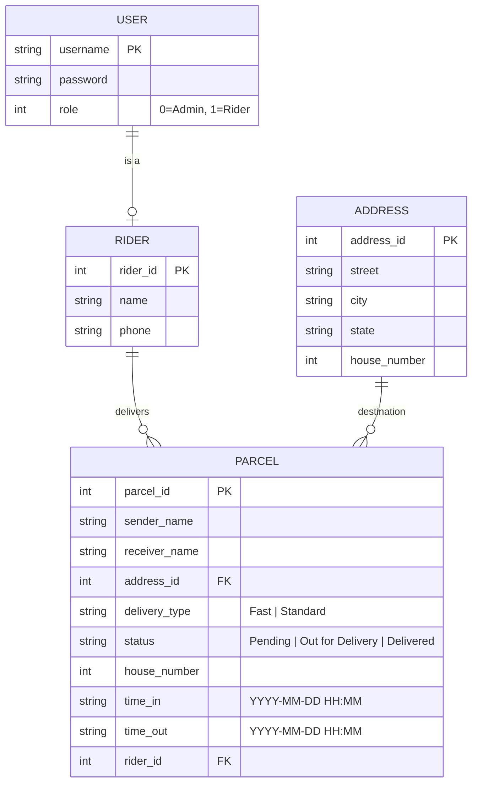

# 🗄️ Database Schema — Parcel Sorting System

This document outlines the data structure and persistence model for the Parcel Sorting System. Although the system uses file-based storage (`.txt` files), the data is organized into structured entities that mimic a relational database.

---

## 1. Entity Relationship Overview

The system consists of four primary entities. In-memory, these are managed using a **Linked List** for Parcels and **Arrays** for Users, Addresses, and Riders.



---

## 2. Table Definitions

### 2.1 Users (`users.txt`)
Stores authentication credentials and access levels.

| Field | Type | Constraint | Description |
| :--- | :--- | :--- | :--- |
| `username` | String (30) | Unique, PK | Unique identifier for login |
| `password` | String (30) | Not Null | Plaintext password (CLI scope) |
| `role` | Integer | 0 or 1 | 0: Admin, 1: Rider |

### 2.2 Riders (`riders.txt`)
Stores profile information for delivery personnel.

| Field | Type | Constraint | Description |
| :--- | :--- | :--- | :--- |
| `rider_id` | Integer | PK | Unique ID matching a User's identifier |
| `name` | String (50) | Not Null | Full name of the rider |
| `phone` | String (15) | Not Null | Contact number |

### 2.3 Addresses (`addresses.txt`)
Predefined delivery zones and streets managed by Admin.

| Field | Type | Constraint | Description |
| :--- | :--- | :--- | :--- |
| `address_id` | Integer | PK | Unique ID for the street/area |
| `street` | String (100) | Not Null | Street or road name |
| `city` | String (50) | Not Null | City name |
| `state` | String (50) | Not Null | State or province |
| `house_number` | Integer | - | Reference house number (if applicable) |

### 2.4 Parcels (`parcels.txt`)
The core entity representing individual deliveries. Managed via **Linked List**.

| Field | Type | Constraint | Description |
| :--- | :--- | :--- | :--- |
| `parcel_id` | Integer | PK | Auto-incremented unique ID |
| `sender_name` | String (50) | Not Null | Name of the sender |
| `receiver_name` | String (50) | Not Null | Name of the recipient |
| `address_id` | Integer | FK (Address) | Link to predefined address |
| `delivery_type`| String (10) | Not Null | "Fast" or "Standard" (Sorting key) |
| `status` | String (20) | Not Null | Current lifecycle stage |
| `house_number` | Integer | Not Null | Specific house ID (Sorting key) |
| `time_in` | String (20) | Not Null | Entry timestamp |
| `time_out` | String (20) | Nullable | Delivery completion timestamp |
| `rider_id` | Integer | FK (Rider) | Assigned rider ID (0 if unassigned) |

---

## 3. Data Integrity & Constraints

### Primary Keys (PK)
- All IDs (`parcel_id`, `address_id`, `rider_id`) must be unique.
- The `database.c` module ensures `parcel_id` uniqueness by finding the `max(id) + 1` during creation.

### Foreign Keys (FK)
- `parcel.address_id` must exist in the `addresses` table.
- `parcel.rider_id` must exist in the `riders` table (or be `0` for unassigned).

### Status Transitions
Parcels must follow a logical lifecycle enforced by `status.c`:
1. `Pending` → `Out for Delivery`
2. `Out for Delivery` → `Delivered`
3. *Delivered parcels are excluded from the sorting engine.*

---

## 4. File Format (CSV)

Data is persisted in comma-separated or pipe-separated text files.

**Example `parcels.txt`:**
```text
1,Ali,Abu,101,Fast,Pending,12,2026-05-06 10:00,,1
2,Siti,Ahmad,102,Standard,Pending,5,2026-05-06 11:30,,0
```
