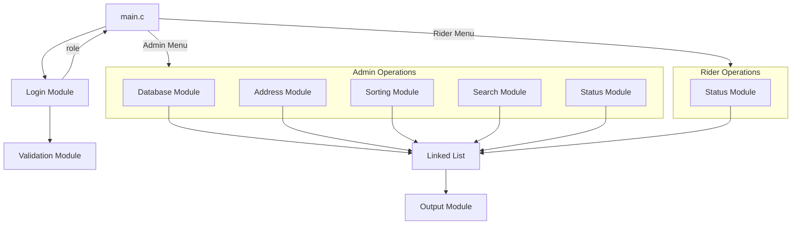

# 🏗️ System Architecture

## 1. Modular Breakdown

The system is divided into **8 modules**, each handling a specific responsibility. Every module is implemented as a separate `.c` file with a corresponding `.h` header.

| Module | File(s) | Owner | Core Responsibility |
|--------|---------|-------|---------------------|
| Login | `login.c` / `login.h` | Khai | Authenticate users, return role |
| Validation | `validation.c` / `validation.h` | Aidil | Validate all user inputs |
| Database | `database.c` / `database.h` | Piki | Load/save data from/to files |
| Parcel Sorting | `sorting.c` / `sorting.h` | Aiman | Sort parcels by type and house number |
| Status Parcel | `status.c` / `status.h` | Kimi | Manage parcel status transitions |
| Address | `address.c` / `address.h` | Kimi | CRUD for delivery addresses |
| Output | `output.c` / `output.h` | Khai | Display formatted parcel data |
| Search Parcel | `search.c` / `search.h` | Aidil | Search/filter parcels |

Additionally, the **linked list** operations are centralized in:
- `parcel_list.c` / `parcel_list.h` — shared by all modules

---

## 2. Module Interaction Map



---

## 3. Data Flow Between Modules

### Startup Flow
```
1. main.c starts
2. database.c loads data files → populates linked list
3. login.c authenticates user → returns role (ADMIN/RIDER)
4. main.c shows role-appropriate menu
```

### Admin — Create Parcel Flow
```
1. Admin selects "Create Parcel"
2. address.c → displays address dropdown (from address list)
3. validation.c → validates parcel input fields
4. parcel_list.c → creates new node, inserts into linked list
5. database.c → persists updated list to file
```

### Admin — Generate Sorting Flow
```
1. Admin selects "Generate Sorting"
2. sorting.c → traverses linked list
3. sorting.c → filters out "Delivered" parcels
4. sorting.c → splits into Fast/Standard groups
5. sorting.c → sorts each group by house number (ASC)
6. sorting.c → merges into final sorted queue
7. output.c → displays sorted table to Admin
```

### Rider — View & Deliver Flow
```
1. Rider selects "View Sorted Parcels"
2. sorting.c → generates sorted list (same logic)
3. output.c → displays sorted table to Rider
4. Rider selects "Update Status"
5. status.c → validates transition (e.g., Pending → Out for Delivery)
6. parcel_list.c → updates node in linked list
7. database.c → persists changes
```

---

## 4. Integration Architecture

### How Modules Connect

All modules communicate through **two shared resources**:

1. **The Linked List** (`ParcelNode *head`) — passed by pointer to every module function
2. **Header files** — each module exposes its public API through `.h` files

```
┌──────────────────────────────────────────────────────┐
│                      main.c                          │
│  #include "login.h"                                  │
│  #include "database.h"                               │
│  #include "sorting.h"                                │
│  #include "output.h"                                 │
│  #include "status.h"                                 │
│  #include "address.h"                                │
│  #include "search.h"                                 │
│  #include "validation.h"                             │
│  #include "parcel_list.h"                            │
│                                                      │
│  ParcelNode *head = NULL;  ← single shared list      │
│                                                      │
│  load_parcels_from_file(&head);                      │
│  int role = login();                                 │
│  if (role == ADMIN) show_admin_menu(&head);          │
│  if (role == RIDER) show_rider_menu(&head);          │
│  save_parcels_to_file(head);                         │
│  free_all_parcels(&head);                            │
└──────────────────────────────────────────────────────┘
```

### Integration Rules
- Every module receives `ParcelNode **head` (pointer to pointer) when it needs to modify the list
- Every module receives `ParcelNode *head` (pointer) when it only reads the list
- No module directly reads/writes files — only `database.c` handles file I/O
- All input validation goes through `validation.c`

---

## 5. Linked List Structure for Parcel Storage

### Node Structure

```c
// Parcel data stored in each node
typedef struct {
    int parcel_id;
    char sender_name[50];
    char receiver_name[50];
    int address_id;           // links to Address table
    char delivery_type[10];   // "Fast" or "Standard"
    char status[20];          // "Pending", "Out for Delivery", "Delivered"
    int house_number;         // for sorting
    char time_in[20];         // timestamp when parcel entered system
    char time_out[20];        // timestamp when delivered (empty if not)
    int rider_id;             // assigned rider (0 if unassigned)
} Parcel;

// Linked list node
typedef struct ParcelNode {
    Parcel data;
    struct ParcelNode *next;
} ParcelNode;
```

### Visual Representation

```
head → [Parcel A | next] → [Parcel B | next] → [Parcel C | next] → NULL
```

Each node contains:
- **data**: A complete `Parcel` struct with all parcel information
- **next**: Pointer to the next node in the list

### How Modules Access the Linked List

| Module | Operation | Access Type |
|--------|-----------|-------------|
| Database | Load all parcels from file into list | **Write** (build list) |
| Database | Save all parcels from list to file | **Read** (traverse list) |
| Parcel Sorting | Traverse, filter, reorder nodes | **Read** (build sorted copy) |
| Status | Find node by ID, update status field | **Read + Update** |
| Search | Traverse list, match criteria | **Read** |
| Output | Traverse list, format and print | **Read** |
| Address | Lookup address_id in parcel nodes | **Read** |
| Login | Does not access parcel list | **None** |
| Validation | Does not access parcel list | **None** |

### Key Operations on the List

#### Insert (Add Parcel)
```
New node → malloc → fill data → link to head → update head
```

#### Delete (Remove Parcel)
```
Find node → unlink from chain → free memory
```

#### Search (Find Parcel)
```
Start at head → traverse → compare field → return match or NULL
```

#### Sort (Generate Delivery Queue)
```
Traverse → filter (skip Delivered) → split into Fast/Standard →
sort each sub-list by house_number → merge Fast first, then Standard
```

#### Update (Change Status)
```
Find node by parcel_id → modify status field → update time_out if Delivered
```

---

## 6. Supporting Data Structures

### User Structure (for Login)

```c
typedef struct {
    char username[30];
    char password[30];
    int role;  // 0 = Admin, 1 = Rider
} User;
```

### Address Structure

```c
typedef struct {
    int address_id;
    char street[100];
    char city[50];
    char state[50];
    int house_number;
} Address;
```

### Rider Structure

```c
typedef struct {
    int rider_id;
    char name[50];
    char phone[15];
} Rider;
```

> These can be stored in simple arrays (since their count is small and fixed) or in their own linked lists if the team prefers consistency.

---

## 7. Data Persistence Model

```
┌─────────────┐    load     ┌──────────────┐
│  users.txt  │ ──────────→ │  User Array  │
└─────────────┘             └──────────────┘

┌──────────────┐    load     ┌──────────────────┐
│ parcels.txt  │ ──────────→ │  Linked List     │
└──────────────┘             │  (ParcelNode *)  │
                             └──────────────────┘

┌───────────────┐    load     ┌────────────────┐
│ addresses.txt │ ──────────→ │  Address Array │
└───────────────┘             └────────────────┘

┌─────────────┐    load     ┌───────────────┐
│ riders.txt  │ ──────────→ │  Rider Array  │
└─────────────┘             └───────────────┘
```

- Data is loaded into memory at program start
- All operations work on in-memory structures
- Data is saved back to files before program exits
