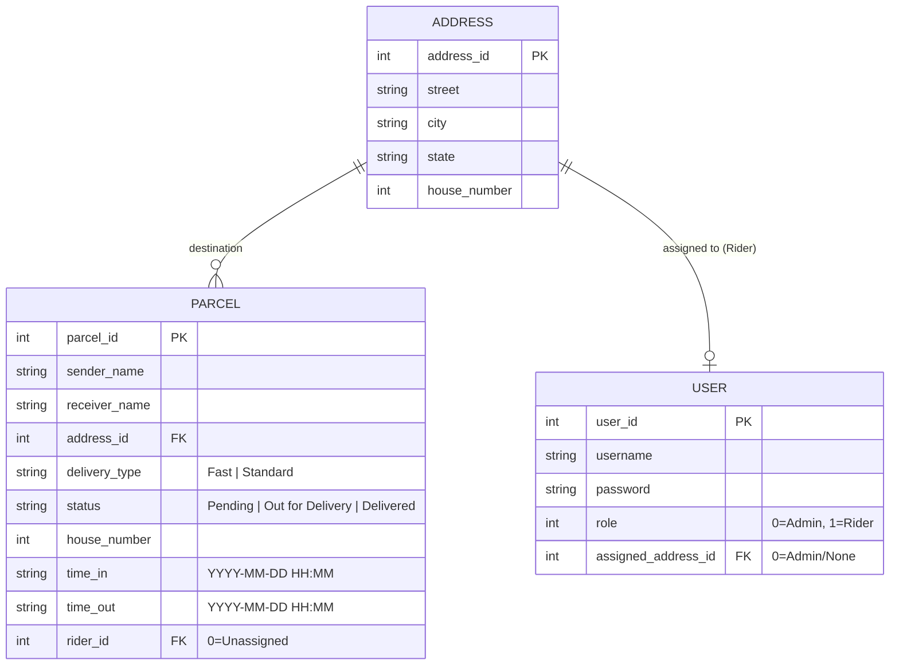

# 🗄️ V2 Database Schema — Parcel Sorting System

This document outlines the updated data structure and persistence model for the Parcel Sorting System (V2). The system uses file-based storage (`.txt` files) but enforces relational integrity for one-to-one and one-to-many relationships.

---

## 1. Entity Relationship Overview

The V2 system removed the redundant Rider structure and merged it directly into the `USER` entity, creating a direct one-to-one relational tie between a Rider and their assigned Road/Address.

---

## 2. Table Definitions

### 2.1 Users (`users.txt`)
Stores authentication credentials, access levels, and strict relational road assignment.

| Field | Type | Constraint | Description |
| :--- | :--- | :--- | :--- |
| `user_id` | Integer | PK, Unique | Internal user ID |
| `username` | String (30) | Unique | Unique identifier for login |
| `password` | String (30) | Not Null | Plaintext password (CLI scope) |
| `role` | Integer | 0 or 1 | 0: Admin, 1: Rider |
| `assigned_address_id`| Integer | FK, Unique for Riders | Maps 1-to-1 to an Address ID |

### 2.2 Addresses (`addresses.txt`)
Predefined delivery zones and streets managed by Admin.

| Field | Type | Constraint | Description |
| :--- | :--- | :--- | :--- |
| `address_id` | Integer | PK, Unique | Unique ID for the street/area |
| `street` | String (100) | Not Null | Street or road name |
| `city` | String (50) | Not Null | City name |
| `state` | String (50) | Not Null | State or province |
| `house_number` | Integer | - | Reference house number |

### 2.3 Parcels (`parcels.txt`)
The core entity representing individual deliveries. Managed via **Linked List**.

| Field | Type | Constraint | Description |
| :--- | :--- | :--- | :--- |
| `parcel_id` | Integer | PK, Unique | Auto-incremented unique ID |
| `sender_name` | String (50) | Not Null | Name of the sender |
| `receiver_name` | String (50) | Not Null | Name of the recipient |
| `address_id` | Integer | FK (Address) | Link to predefined address |
| `delivery_type`| String (10) | Not Null | "Fast" or "Standard" |
| `status` | String (20) | Not Null | Lifecycle stage |
| `house_number` | Integer | Not Null | Specific house ID |
| `time_in` | String (20) | Not Null | Entry timestamp |
| `time_out` | String (20) | Nullable | Delivery completion timestamp |
| `rider_id` | Integer | FK (User) | Assigned rider ID (0 if unassigned) |

---

## 3. Data Integrity & Constraints (V2 Strict Mode)

### Primary Keys (PK)
- All IDs (`parcel_id`, `address_id`, `user_id`) are structurally unique.

### Foreign Keys & Uniqueness (FK)
- `parcel.address_id` must exist in the `addresses` table.
- **[V2 Update]** `user.assigned_address_id` must be perfectly unique among active riders. No two riders can share the same road.

### Dynamic Status Transitions
- Parcels follow strict state machines:
  1. `Pending` → `Out for Delivery`
  2. `Out for Delivery` → `Delivered`
  - Cannot reverse or skip states.
