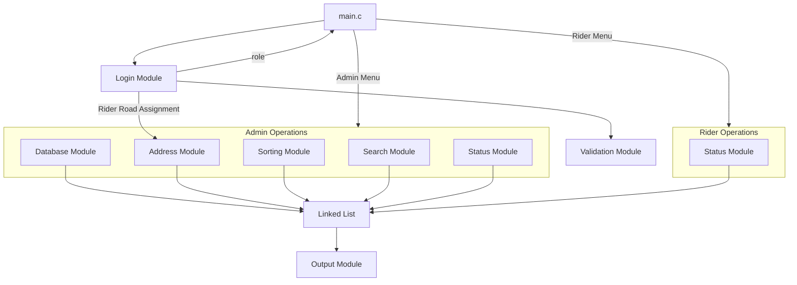

# 🏗️ V2 System Architecture

## 1. Modular Breakdown

The system is divided into **8 modules**, each handling a specific responsibility. Every module is implemented as a separate `.c` file with a corresponding `.h` header.

| Module | File(s) | Owner | Core Responsibility |
|--------|---------|-------|---------------------|
| Login | `login.c` / `login.h` | Khai | Authenticate users, manage riders, enforce road uniqueness |
| Validation | `validation.c` / `validation.h` | Aidil | Validate inputs and manage Double Escape Hatch |
| Database | `database.c` / `database.h` | Piki | Load/save data from/to files |
| Parcel Sorting | `sorting.c` / `sorting.h` | Aiman | Sort parcels by type and house number |
| Status Parcel | `status.c` / `status.h` | Kimi | State machine for parcel status transitions |
| Address | `address.c` / `address.h` | Kimi | CRUD for delivery addresses |
| Output | `output.c` / `output.h` | Khai | Display formatted relational data |
| Search Parcel | `search.c` / `search.h` | Aidil | Search/filter parcels |

Additionally, the **linked list** operations are centralized in:
- `parcel_list.c` / `parcel_list.h` — shared by all modules | Khai

---

## 2. Module Interaction Map (V2 Update)



---

## 3. Data Flow Between Modules

### Startup Flow
```
1. main.c starts
2. database.c loads data files → populates linked list, users array, and addresses array
3. login.c authenticates user → returns role (ADMIN/RIDER)
4. main.c shows role-appropriate menu
```

### Admin — Create Parcel Flow (Loopable UI)
```
1. Admin selects "Create Parcel"
2. login.c / address.c → displays addresses WITH assigned riders
3. validation.c → parses input. Admin can type 0 to cancel (Double Escape Hatch)
4. parcel_list.c → creates new node, inserts into linked list
5. database.c → persists updated list to file
```

### Rider — View & Deliver Flow (State Machine)
```
1. Rider selects "View Sorted Parcels"
2. sorting.c → generates sorted queue filtered for Rider's assigned road
3. output.c → displays sorted table to Rider
4. Rider selects "Update Status"
5. status.c → dynamically filters valid transitions (e.g. Pending -> Out for Delivery)
6. parcel_list.c → updates node in linked list
7. database.c → persists changes
```

---

## 4. Supporting Data Structures (Relational Changes)

### User Structure (Merged with Rider)

```c
typedef struct {
    int user_id;
    char username[30];
    char password[30];
    int role;                 // 0 = Admin, 1 = Rider
    int assigned_address_id;  // 1-to-1 strict relational mapping
} User;
```

### Address Structure

```c
typedef struct {
    int address_id;
    char street[100];
    char city[50];
    char state[50];
    int house_number;
} Address;
```

---

## 5. Data Persistence Model (V2 Schema)

```
┌─────────────┐    load     ┌──────────────┐
│  users.txt  │ ──────────→ │  User Array  │
└─────────────┘             └──────────────┘

┌──────────────┐    load     ┌──────────────────┐
│ parcels.txt  │ ──────────→ │  Linked List     │
└──────────────┘             │  (ParcelNode *)  │
                             └──────────────────┘

┌───────────────┐    load     ┌────────────────┐
│ addresses.txt │ ──────────→ │  Address Array │
└───────────────┘             └────────────────┘
```

> **Note:** `riders.txt` was fully deprecated in V2 to eliminate data duplication. User array handles all Rider details through `assigned_address_id`.
